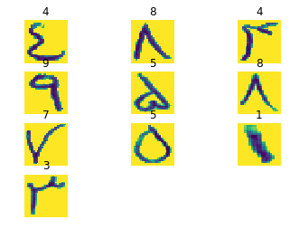
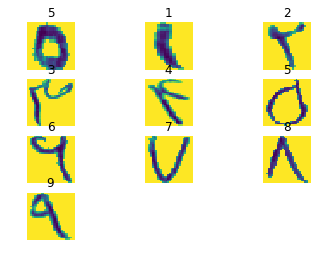

# Recognizing Persian Digits


```python
import matplotlib.pyplot as plt
import numpy as np
import os
import sys
import tarfile
import random
import utils
from PIL import Image
from IPython.display import display
from keras.layers import Dense
from keras.layers import Conv2D
from keras.layers import MaxPooling2D
from keras.layers import AveragePooling2D
from keras.layers import Flatten
from keras.models import Sequential
from keras.models import load_model
from keras.optimizers import Adam
from scipy import ndimage
from __future__ import print_function
from sklearn.linear_model import LogisticRegression
from sklearn.model_selection import train_test_split
from six.moves.urllib.request import urlretrieve
from six.moves import cPickle as pickle
%matplotlib inline
```

    Using TensorFlow backend.
    


```python
root = './data/Digits/isolated digits/'
prediction_root = './data/Digits/segmented digits/'
binary_save_path = './binary_data/isolated digits/'
model_save_path = './models/'
num_labels= 10
image_size = 28
```

## Contents
* Loading and Preprocessing 
* Model Implementation
* Training
* Model Evaluation
* Prediction

## Loading and Preprocessing Data

First we will load and normalize data, then we resize all of the images in (28,28) size and save it to binary .npy file :


```python
data_paths = utils.maybe_save(root,binary_save_path,image_size)
```

    ./binary_data/isolated digits/0.npy already present - Skipping pickling.
    ./binary_data/isolated digits/1.npy already present - Skipping pickling.
    ./binary_data/isolated digits/2.npy already present - Skipping pickling.
    ./binary_data/isolated digits/3.npy already present - Skipping pickling.
    ./binary_data/isolated digits/4.npy already present - Skipping pickling.
    ./binary_data/isolated digits/5.npy already present - Skipping pickling.
    ./binary_data/isolated digits/6.npy already present - Skipping pickling.
    ./binary_data/isolated digits/7.npy already present - Skipping pickling.
    ./binary_data/isolated digits/8.npy already present - Skipping pickling.
    ./binary_data/isolated digits/9.npy already present - Skipping pickling.
    

Checking if data is Balanced across diffrent classes : 


```python
def balancingCheck(data_folder) :
    tmpList = None
    for i,ds in enumerate(data_folder) :
        dataset = np.load(ds)
        print("number of images in %s is equal to %s" % (ds,len(dataset)))
balancingCheck(data_paths)
```

    number of images in ./binary_data/isolated digits/0.npy is equal to 975
    number of images in ./binary_data/isolated digits/1.npy is equal to 942
    number of images in ./binary_data/isolated digits/2.npy is equal to 990
    number of images in ./binary_data/isolated digits/3.npy is equal to 945
    number of images in ./binary_data/isolated digits/4.npy is equal to 958
    number of images in ./binary_data/isolated digits/5.npy is equal to 994
    number of images in ./binary_data/isolated digits/6.npy is equal to 962
    number of images in ./binary_data/isolated digits/7.npy is equal to 956
    number of images in ./binary_data/isolated digits/8.npy is equal to 982
    number of images in ./binary_data/isolated digits/9.npy is equal to 949
    

As you see data is almost balanced over diffrent classes.

Merging and Creating Label for datasets :


```python
def merge_datasets(data_paths) :    
    data = np.concatenate([np.load(path) for path in data_paths],axis=0)
    label = np.concatenate([[path[-5]]*len(np.load(path)) for i,path in enumerate(data_paths)])
    return data,label
data,labels = merge_datasets(data_paths)
```

We should shuffle data for cnn trainer :


```python
def randomize(dataset, labels):
    permutation = np.random.permutation(labels.shape[0])
    shuffled_dataset = dataset[permutation,:,:]
    shuffled_labels = labels[permutation]
    return shuffled_dataset, shuffled_labels
data,labels = randomize(data,labels)
```

We want to make sure that data still looks good :


```python
def visualize(dataset,labels,size = 10) :
    samples = np.random.randint(len(dataset),size=size)
    for i,sample in enumerate(samples) :
        plt.subplot(np.ceil(np.sqrt(size)),np.floor(np.sqrt(size)),1+i)
        plt.axis('off')
        plt.title(labels[sample])
        plt.imshow(dataset[sample])
visualize(data,labels,10)
```





```python
def reformat(data,labels) :
    data = np.array(data).reshape((-1,image_size,image_size,1)).astype(np.float32)
    labels = (np.arange(num_labels) == labels[:,None].astype(np.float32))
    return data,labels
```


```python
data,labels = reformat(data,labels)
print('shape of data : {}'.format(data.shape))
print('shape of labels : {}'.format(labels.shape))
```

    shape of data : (9653, 28, 28, 1)
    shape of labels : (9653, 10)
    


```python
def train_valid_test_spliter(data,labels) :
    X_train, X_test, y_train, y_test = train_test_split(data, labels, test_size=0.2, random_state=1)
    X_train, X_val, y_train, y_val = train_test_split(X_train, y_train, test_size=0.2, random_state=1)
    return X_train,y_train,X_val,y_val,X_test,y_test
```


```python
X_train,y_train,X_val,y_val,X_test,y_test = train_valid_test_spliter(data,labels)
```


```python
print('train data shape: {}'.format(X_train.shape))
print('train labels shape: {}'.format(X_train.shape))
print('valid data shape : {}'.format(X_val.shape))
print('valid labels shape: {}'.format(y_val.shape))
print('test data shape : {}'.format(X_test.shape))
print('test labels shape: {}'.format(y_test.shape))
```

    train data shape: (6177, 28, 28, 1)
    train labels shape: (6177, 28, 28, 1)
    valid data shape : (1545, 28, 28, 1)
    valid labels shape: (1545, 10)
    test data shape : (1931, 28, 28, 1)
    test labels shape: (1931, 10)
    

## Model Implementation


```python
def conv_model(input_shape) :
    
    model = Sequential()
    model.add(Conv2D(16, 5, padding='same', activation='selu', input_shape=input_shape))
    model.add(Conv2D(16, 5, padding='same', activation='selu'))
    model.add(Conv2D(16, 5, padding='same', activation='selu'))
    model.add(Conv2D(16, 5, padding='same', activation='selu'))
    model.add(Conv2D(16, 5, padding='same', activation='selu'))
    model.add(Conv2D(16, 5, padding='same', activation='selu'))
    model.add(Conv2D(16, 5, padding='same', activation='selu'))
    model.add(Conv2D(16, 5, padding='same', activation='selu'))
    model.add(MaxPooling2D())

    model.add(Conv2D(32, 3, padding='same', activation='selu'))
    model.add(Conv2D(32, 3, padding='same', activation='selu'))
    model.add(Conv2D(32, 3, padding='same', activation='selu'))
    model.add(Conv2D(32, 3, padding='same', activation='selu'))
    model.add(Conv2D(32, 3, padding='same', activation='selu'))
    model.add(Conv2D(32, 3, padding='same', activation='selu'))
    model.add(Conv2D(32, 3, padding='same', activation='selu'))
    model.add(Conv2D(32, 3, padding='same', activation='selu'))
    model.add(MaxPooling2D())

    model.add(Conv2D(64, 3, padding='same', activation='selu'))
    model.add(Conv2D(64, 3, padding='same', activation='selu'))
    model.add(Conv2D(64, 3, padding='same', activation='selu'))
    model.add(Conv2D(64, 3, padding='same', activation='selu'))
    model.add(Conv2D(64, 3, padding='same', activation='selu'))
    model.add(Conv2D(64, 3, padding='same', activation='selu'))
    model.add(Conv2D(64, 3, padding='same', activation='selu'))
    model.add(Conv2D(64, 3, padding='same', activation='selu'))
    model.add(AveragePooling2D())

    model.add(Flatten())

    model.add(Dense(1024, activation='selu'))
    model.add(Dense(1024, activation='selu'))
    model.add(Dense(10, activation='softmax'))

    model.compile(optimizer=Adam(lr=1e-4), loss='categorical_crossentropy', metrics=['accuracy'])
    
    return model
```

## Training


```python
def train_model(input_shape,X_train,y_train,X_val,y_val,batch_size=64,epochs=100,model_name = 'conv_model.h5') :
    model_path = os.path.join(model_save_path,model_name)
    if os.path.exists(model_path) :
        print('model already exist in : {}'.format(model_path))
        return load_model(model_path)
    else :
        model = conv_model(input_shape)
        model.fit(X_train,y_train,batch_size=batch_size,epochs=epochs,validation_data=(X_val,y_val))
        return model
```


```python
model = train_model((image_size,image_size,1),X_train,y_train,
                    X_val,y_val,64,40,'conv_model.h5')
```

    model already exist in : ./models/conv_model.h5
    


```python
model.summary()
```

    _________________________________________________________________
    Layer (type)                 Output Shape              Param #   
    =================================================================
    conv2d_1 (Conv2D)            (None, 28, 28, 16)        416       
    _________________________________________________________________
    conv2d_2 (Conv2D)            (None, 28, 28, 16)        6416      
    _________________________________________________________________
    conv2d_3 (Conv2D)            (None, 28, 28, 16)        6416      
    _________________________________________________________________
    conv2d_4 (Conv2D)            (None, 28, 28, 16)        6416      
    _________________________________________________________________
    conv2d_5 (Conv2D)            (None, 28, 28, 16)        6416      
    _________________________________________________________________
    conv2d_6 (Conv2D)            (None, 28, 28, 16)        6416      
    _________________________________________________________________
    conv2d_7 (Conv2D)            (None, 28, 28, 16)        6416      
    _________________________________________________________________
    conv2d_8 (Conv2D)            (None, 28, 28, 16)        6416      
    _________________________________________________________________
    max_pooling2d_1 (MaxPooling2 (None, 14, 14, 16)        0         
    _________________________________________________________________
    conv2d_9 (Conv2D)            (None, 14, 14, 32)        4640      
    _________________________________________________________________
    conv2d_10 (Conv2D)           (None, 14, 14, 32)        9248      
    _________________________________________________________________
    conv2d_11 (Conv2D)           (None, 14, 14, 32)        9248      
    _________________________________________________________________
    conv2d_12 (Conv2D)           (None, 14, 14, 32)        9248      
    _________________________________________________________________
    conv2d_13 (Conv2D)           (None, 14, 14, 32)        9248      
    _________________________________________________________________
    conv2d_14 (Conv2D)           (None, 14, 14, 32)        9248      
    _________________________________________________________________
    conv2d_15 (Conv2D)           (None, 14, 14, 32)        9248      
    _________________________________________________________________
    conv2d_16 (Conv2D)           (None, 14, 14, 32)        9248      
    _________________________________________________________________
    max_pooling2d_2 (MaxPooling2 (None, 7, 7, 32)          0         
    _________________________________________________________________
    conv2d_17 (Conv2D)           (None, 7, 7, 64)          18496     
    _________________________________________________________________
    conv2d_18 (Conv2D)           (None, 7, 7, 64)          36928     
    _________________________________________________________________
    conv2d_19 (Conv2D)           (None, 7, 7, 64)          36928     
    _________________________________________________________________
    conv2d_20 (Conv2D)           (None, 7, 7, 64)          36928     
    _________________________________________________________________
    conv2d_21 (Conv2D)           (None, 7, 7, 64)          36928     
    _________________________________________________________________
    conv2d_22 (Conv2D)           (None, 7, 7, 64)          36928     
    _________________________________________________________________
    conv2d_23 (Conv2D)           (None, 7, 7, 64)          36928     
    _________________________________________________________________
    conv2d_24 (Conv2D)           (None, 7, 7, 64)          36928     
    _________________________________________________________________
    average_pooling2d_1 (Average (None, 3, 3, 64)          0         
    _________________________________________________________________
    flatten_1 (Flatten)          (None, 576)               0         
    _________________________________________________________________
    dense_1 (Dense)              (None, 1024)              590848    
    _________________________________________________________________
    dense_2 (Dense)              (None, 1024)              1049600   
    _________________________________________________________________
    dense_3 (Dense)              (None, 10)                10250     
    =================================================================
    Total params: 2,042,394
    Trainable params: 2,042,394
    Non-trainable params: 0
    _________________________________________________________________
    

## Model Evaluation


```python
scores = model.evaluate(X_test,y_test)
```

    1931/1931 [==============================] - 2s 1ms/step
    


```python
print('Accuracy : %{}'.format(scores[1]*100))
print("Error : %{}".format(100 - scores[1]*100))

```

    Accuracy : %99.22320041429312
    Error : %0.7767995857068826
    

## Prediction


```python
def predict_image(prediction_root,image_size,model) :
    for i,path in enumerate(os.listdir(prediction_root)):
        photoes_path = os.path.join(prediction_root,path)
        photoes = os.listdir(photoes_path)
        photo_path = np.random.choice(photoes)
        processed_image = (np.array(Image.open(os.path.join(photoes_path, photo_path)).resize((image_size,image_size))).astype(float) - 
                            255.0 / 2) / 255.0
        photo = np.array(Image.open(os.path.join(photoes_path,photo_path)).resize((image_size,image_size))).astype(np.float)
        plt.subplot(np.ceil(np.sqrt(10)),np.floor(np.sqrt(10)),1+i)
        plt.axis('off')
        plt.title(np.argmax(model.predict(processed_image.reshape(1,image_size,image_size,1))))
        plt.imshow(photo)
```


```python
predict_image(prediction_root,image_size,model)
```





## Refrence
	Sadri, Javad, Mohammad Reza Yeganehzad, and Javad Saghi "A novel comprehensive database for offline Persian
	handwriting recognition." Pattern Recognition 60 (2016): 378-393.